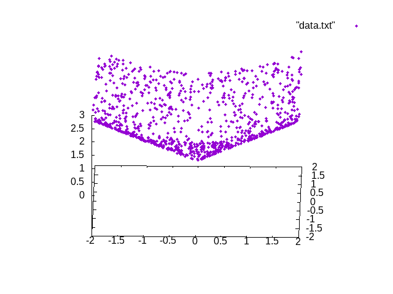
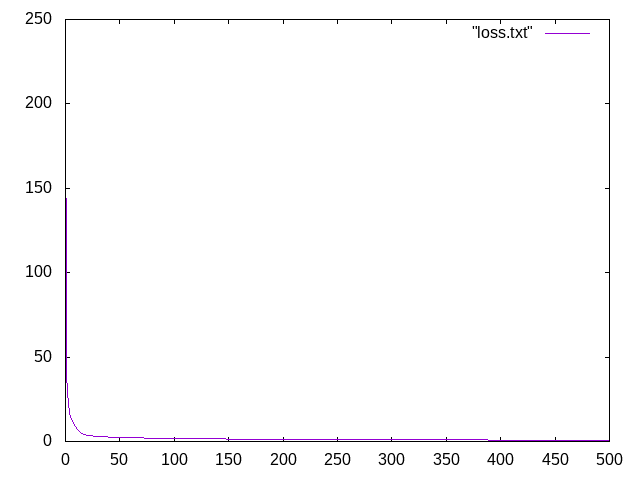
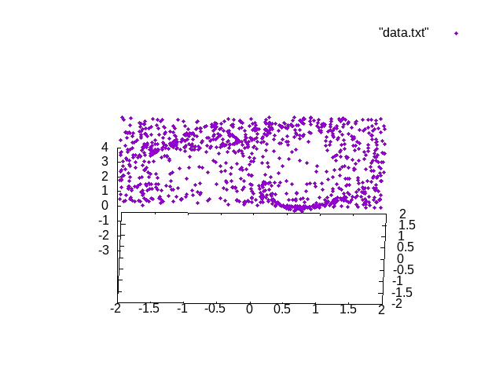
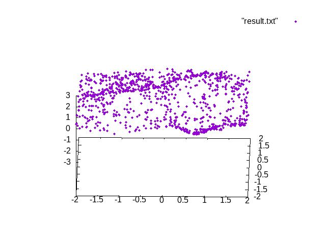

# back_propagation

誤差逆伝播法のRust実装

2入力1出力の非線形関数を考え, この入出力を模擬するニューラルネットワークを誤差逆伝播法で学習する.
ニューラルネットワークは3層で2入力なので, 入力層のノード数はバイアルを加えた3, 中間層のノード数は10, そして出力層は1となる.
学習するデータは乱数で1000個生成し, イテレーション1000, 学習率0.1で学習した.

2入力1出力の非線形関数：x1^2 + x2^2 
教師データと, モデルに通した値

1回のイテレーションで1000個のデータを1組ずつニューラルネットワークに流して重みを調整するので
教師データとニューラルネットワークの出力の二乗誤差はすぐ小さくなる

2入力1出力の非線形関数：8.0 * (-x1^2 - x2^2).exp() * (0.1 + x1 * (x2 - 0.5)) 
教師データと, モデルに通した値

